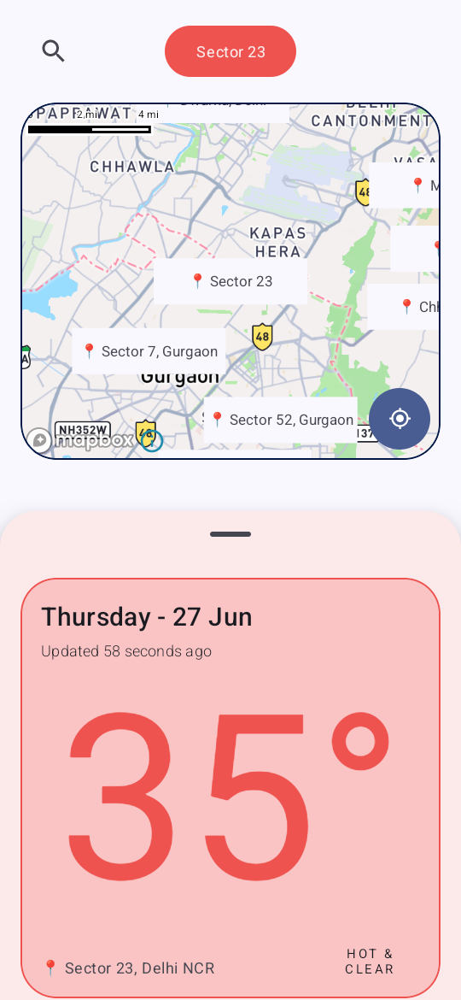
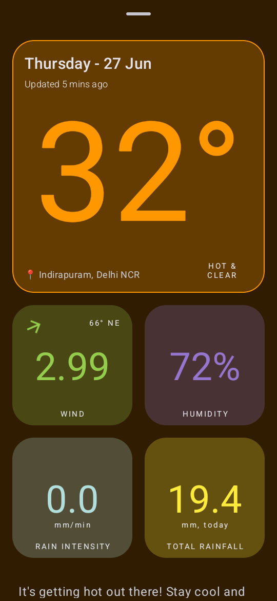

# MausamLive - Indian Weather App

MausamLive is an Indian weather app built on Zomato's WeatherUnion service to provide real-time weather data. The app offers a user-friendly interface with light and dark mode options, featuring a map view of cities and detailed weather information for selected localities.

## Supported Weather Sensors

- Temperature (C)
- Wind Speed (m/s)
- Wind Direction (degrees)
- Humidity (%)
- Rain Intensity (mm/min)
- Rain Accumulation (mm since 12AM)
  
## Features

- Real-time weather updates
- Light and Dark mode
- Map view of cities with weather sensors
- Detailed weather data for selected localities

## Screenshots

### Dashboard - Light Mode


### Mausam Details - Light Mode


### Mausam Details - Dark Mode


## Installation

To install and run MausamLive, follow these steps:

1. Clone the repository:
    ```sh
    git clone https://github.com/yourusername/MausamLive.git
    ```

2. Open the project in Android Studio.

3. Change/add the string resource in strings.xml file:
   ```xml
   <string name="api_key_release">GET YOUR API FROM weatherunion.com AND PUT HERE</string>
   <string name="mapbox_key_public">GET YOUR PUBLIC API FROM mapbox.com AND PUT HERE</string>```
4. Add a gradle.properties file to the users/.gradle/ directory with contents:
   ```groovy
   MAPBOX_DOWNLOADS_TOKEN=[GET SECRET TOKEN FROM MAPBOX DASHBOARD AND PUT IT HERE WITHOUT [] ]
   ```
6. Build and run the project on an Android device or emulator.
